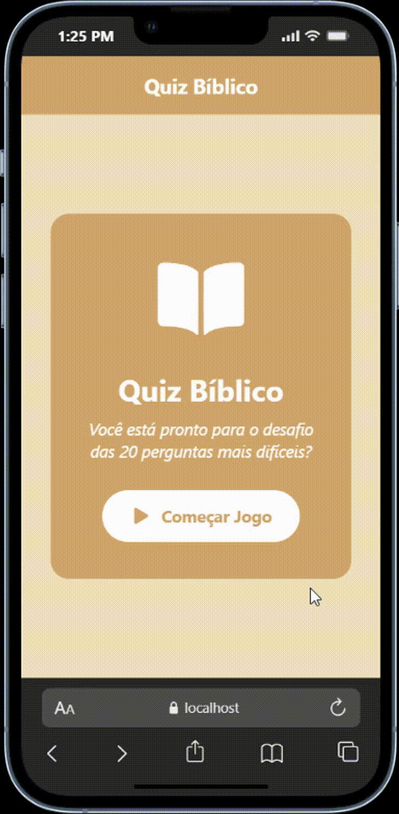

# Quiz Bíblico

## Curso Técnico de Desenvolvimento de Sistemas - Senai Itapeva


Este projeto é um aplicativo mobile de perguntas e respostas sobre a Bíblia. O jogador responde a 20 questões com alternativas, acompanha o progresso e recebe o resultado ao final da partida.

## Demonstração

<p align="center">
  
</p>

O GIF acima mostra o fluxo do quiz, incluindo a seleção de respostas, o cronômetro e o resultado da partida.

## Funcionalidade Adicional: Cronômetro e Feedback da Resposta

### Descrição

Além da listagem das perguntas, o aplicativo possui um cronômetro de 30 segundos para cada questão. Quando o tempo chega a 10 segundos, o contador muda de cor e o dispositivo vibra para alertar o jogador. Se o tempo acabar, a questão é encerrada automaticamente e o quiz avança para a próxima pergunta.

Depois que uma alternativa é selecionada, o aplicativo bloqueia novas escolhas, destaca a resposta correta e informa visualmente quando a opção escolhida está errada. O feedback háptico também indica se a resposta foi correta ou incorreta.

### Desafios e Aprendizados

Para implementar essa funcionalidade, foi necessário pesquisar sobre o Hook `useEffect` para criar e limpar o intervalo do cronômetro, além de estudar o gerenciamento de estado com `useState` para controlar o tempo, a alternativa selecionada e o avanço entre as perguntas. Também foi necessário aprender a utilizar `expo-haptics` e `Vibration` do React Native para fornecer feedback ao jogador.

## Visão Geral

O aplicativo foi desenvolvido com React Native, Expo e TypeScript para praticar componentização, gerenciamento de estado, consumo de dados locais e criação de interfaces interativas para dispositivos móveis.

## Funcionalidades

1. **Tela inicial**
   - Apresentação do Quiz Bíblico.
   - Botão para iniciar uma nova partida.

2. **Quiz com tempo limitado**
   - Uma pergunta é exibida por vez.
   - Cada questão possui quatro alternativas.
   - O jogador tem 30 segundos para responder cada pergunta.
   - O cronômetro muda de cor e emite um alerta quando o tempo está acabando.

3. **Feedback das respostas**
   - Alternativas corretas e incorretas são destacadas após a escolha.
   - Vibração e feedback háptico indicam o resultado da resposta.
   - O avanço para a próxima pergunta acontece automaticamente.

4. **Resultado final**
   - Exibição da quantidade de acertos.
   - Mensagem de desempenho conforme a pontuação.
   - Opção para iniciar uma nova tentativa.

## Tecnologias Utilizadas

- React Native
- Expo SDK 54
- Expo Router
- TypeScript
- Expo Haptics
- Expo Vector Icons

## Estrutura de Arquivos

```text
quiz-app/
|-- app/
|   |-- _layout.tsx       # Configuração da navegação e do cabeçalho
|   |-- index.tsx         # Controle das telas do aplicativo
|-- components/
|   |-- StartScreen.tsx   # Tela inicial
|   |-- QuizScreen.tsx    # Perguntas, alternativas e cronômetro
|   |-- ResultScreen.tsx  # Pontuação e reinício do quiz
|-- assets/
|   |-- images/           # Ícones e imagens do aplicativo
|-- questions.json        # Banco local com as perguntas e respostas
|-- app.json              # Configurações do Expo
|-- package.json          # Dependências e scripts do projeto
```

## Como Executar

### Pré-requisitos

- Node.js instalado.
- Expo Go em um dispositivo Android ou iOS, ou um emulador configurado.

### Instalação

1. Instale as dependências:

```bash
npm install
```

2. Inicie o servidor de desenvolvimento:

```bash
npx expo start
```

3. Abra o aplicativo usando uma das opções exibidas no terminal ou no painel do Expo.

Também é possível executar diretamente em uma plataforma específica:

```bash
npm run android
npm run ios
npm run web
```

## Scripts Disponíveis

| Comando | Descrição |
| --- | --- |
| `npm start` | Inicia o servidor do Expo |
| `npm run android` | Abre o projeto no Android |
| `npm run ios` | Abre o projeto no iOS |
| `npm run web` | Executa a versão web |
| `npm run lint` | Verifica problemas de lint |

## Dados do Quiz

As perguntas ficam no arquivo `questions.json`. Cada registro possui o enunciado, quatro opções de resposta e a alternativa correta:

```json
{
  "question": "Qual o nome do pai de Abraão?",
  "options": ["Terá", "Naor", "Harã", "Ló"],
  "correctAnswer": "Terá"
}
```

Para adicionar ou alterar questões, edite esse arquivo mantendo essa estrutura.

## Competências Desenvolvidas

- Desenvolvimento de interfaces mobile com React Native.
- Uso de componentes reutilizáveis.
- Gerenciamento de estado com hooks do React.
- Leitura de dados locais em formato JSON.
- Controle de tempo e fluxo de telas.
- Tipagem e organização de um projeto com TypeScript.

## Autor

Desenvolvido por [Lorena Rinaldo](https://www.linkedin.com/in/lorena-rinaldo01/).
